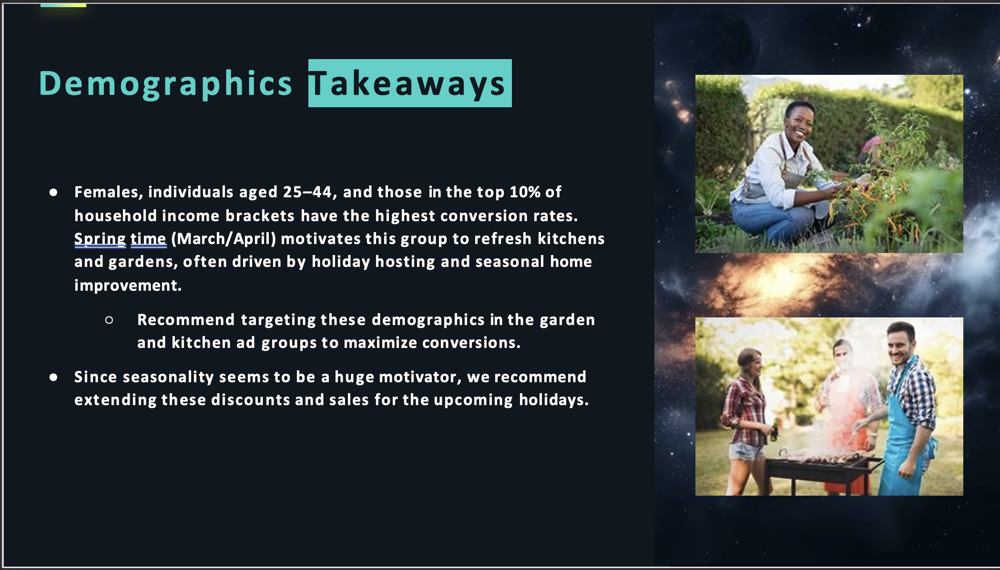

# Mock Home Depot Paid Search Performance Report 
Kepler Summer 2025 
Intern Portfolio Project
  
**Project Focus:** Paid Search Performance & Demographics Analysis 
**My Focus Contribution:**
Demographics Analysis (Audience Segmentation)

---

## Client Overview:  
Home Depot is a leading home improvement retailer with key categories: DIY, Appliances, Brand, Kitchen & Kitchenware, and Lawn & Garden.  

**Campaign Objective:**  
Increase orders across these categories (March 24, 2025 – April 23, 2025).  

**Key Performance Indicators (KPIs):**  
- Impressions (Top-of-Funnel)  
- Clicks & CTR (Mid-Funnel Engagement)  
- Conversions, Conversion Rate, CPA, CPC, ROAS (Bottom-of-Funnel) 

**Tools & Techniques** 
- Excel: SUMIFS, COUNTIFS, IFERROR, VLOOKUP, XLOOKUP, Pivot Tables  
- Analysis Approach: Compare ad groups, top keywords, and demographics to identify high-performing segments and optimize budget allocation.

---
 
## Insights & Key Takeaways

### Ad Group Performance & Trends
Below are slide deck images summarizing performance snapshots, trends, and key findings. 

 
*Brand ad group is top performing, General is underperforming, highlighting budget allocation opportunities.*

 
*Top 5 keywords generate most conversions; optimization opportunities for low-performing keywords.*

![Demographic Performance] (Power_Point_Visuals/Demographic_performance.png) 
*Females, ages 25–44, and the top 10% household income groups have the highest conversions.*

*Demographic targeting can improve ROI. 

*Allocate more budget to females 25–44 and high-income households; use seasonality for timing campaigns.  

## Buisness Recommendations & Next Steps

### Ad Groups
- Allocate more budget to **Brand, Kitchen & Kitchenware, and Lawn & Garden**.  
- Consider removing **General** due to low efficiency.

### Keywords
- Pause low-performing keywords (0 clicks or ROAS <1).  
- Increase bids for high-performing keywords, particularly *Garden Center* and *Home Improvement*.  
- Optimize *Home Services* by improving ad copy and targeting.

### Demographics
- Continue targeting **females, ages 25–44, top 10% household income**.  
- Align campaigns with seasonal trends to maximize conversions.

### Search Ad Creative
- A/B test new ad headlines and descriptions to improve CTR and conversions.
